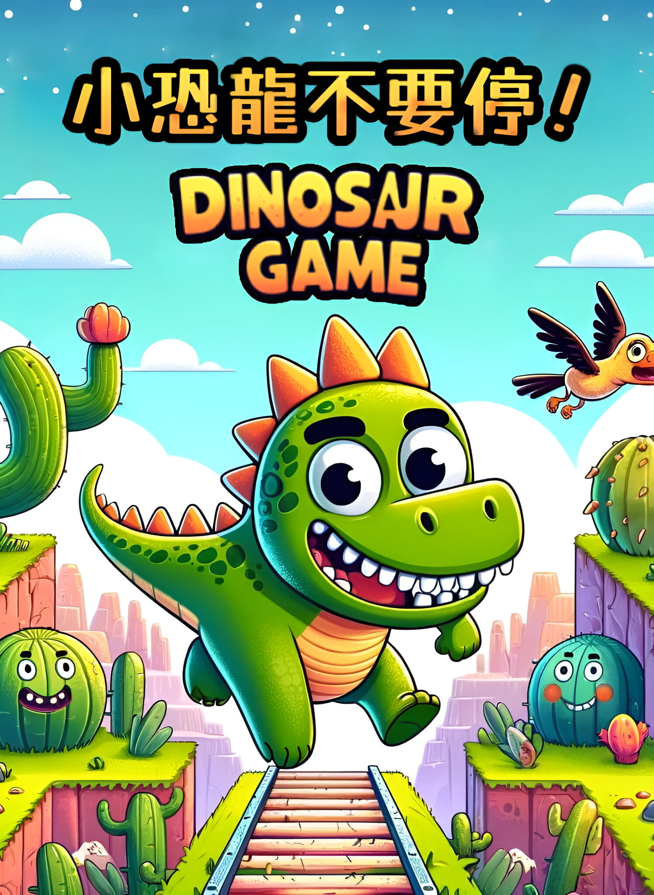
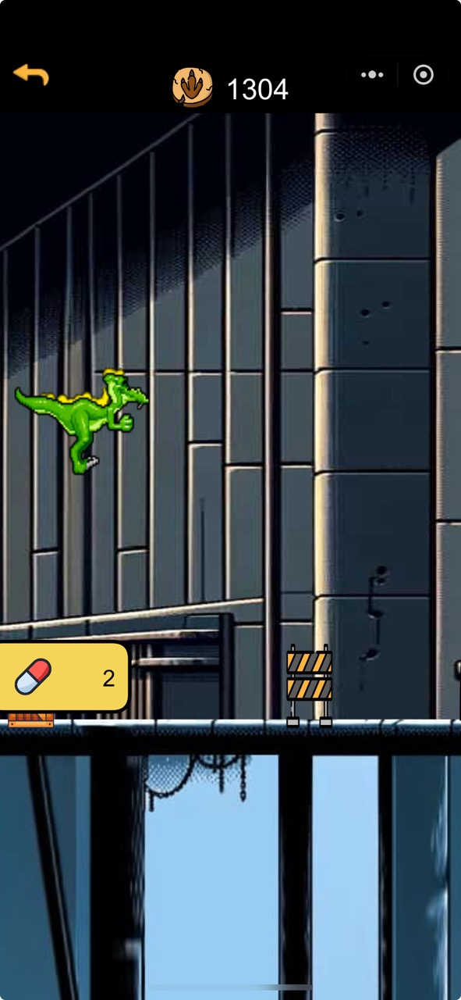
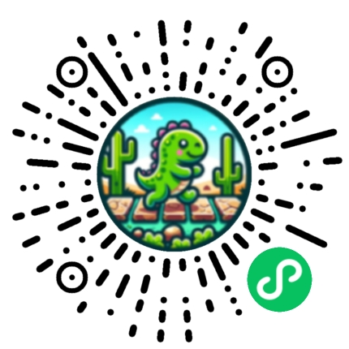

# 小恐龙不要停
一款有趣的微信小游戏，模仿经典的 Chrome Dino 小游戏，使用微信小游戏开发工具开发。

### 游戏封面截图

### 游戏玩法

1. 点击屏幕开始游戏，点击屏幕跳跃，可以使用道具。
2. 避免碰到障碍物，碰到障碍物游戏结束。
3. 随着游戏进行，障碍物速度会越来越快，难度也会逐渐提高。

### 制作过程

1. 使用微信小游戏开发工具创建项目。
2. 设计游戏界面，包括背景、角色、障碍物等。
3. 编写游戏逻辑，包括角色跳跃、障碍物生成、碰撞检测等。
4. 测试游戏，修复bug，优化游戏体验。
5. 上传游戏到微信小游戏平台，发布游戏。

### 经验分享

- 角色、封面和场景，使用 AI 生成图片，提高了工作效率
- 音乐可以用 Suno 等 AI 生成，几乎完成了之前无法完成的工作

### 游戏内容截图

### 微信扫一扫试玩

